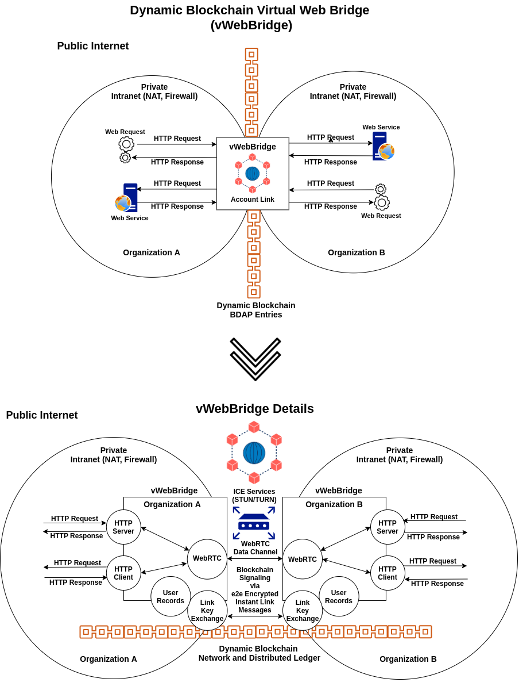
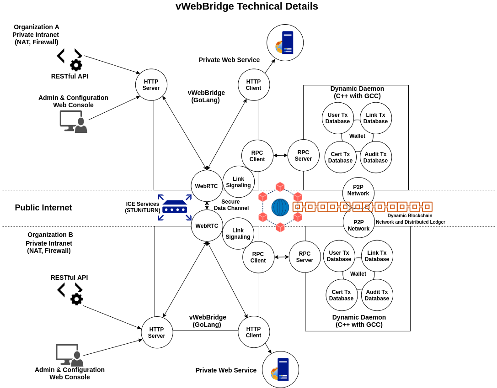

# bridge


Connecting HTTP servers and clients on disparate networks using WebRTC and blockchain signaling

## Development Requirements
- [GoLang](https://golang.org/dl/) v1.14 or above.
- NVM, TypeScript, Yarn and React for [Admin Console](web/README.md)

## Running with dev and debug mode

```go
go run -race . -dev -debug
```

### Building

```go
# Linux Requires sudo apt-get install protobuf-compiler
go get -u -v github.com/golang/protobuf/proto
go get -u -v github.com/golang/protobuf/protoc-gen-go
protoc --go_out=. internal/goproxy/*.proto
go build -i -v -ldflags="-X 'main.GitHash=$(git describe --always --long --dirty)' -X 'main.Version=$(date +'%y.%m.%d')'" github.com/duality-solutions/web-bridge
```

```go
# Windows Requires protobuf compiler: https://github.com/protocolbuffers/protobuf/releases
go get -u -v github.com/golang/protobuf/proto
go get -u -v github.com/golang/protobuf/protoc-gen-go
protoc --go_out=. internal/goproxy/*.proto
go build -i -v -ldflags="-X 'main.GitHash=$(git describe --always --long --dirty)' -X 'main.Version=$(Get-Date -Format "yy.MM.dd")'" github.com/duality-solutions/web-bridge
```

#### Windows NMake

```shell
nmake /f Makefile
```

#### Linux Make

```bash
make
```

### Diagrams




